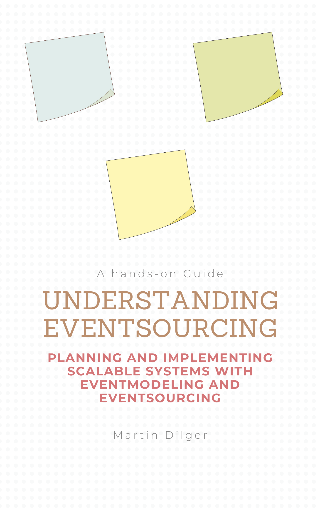

# Understanding Eventsourcing

[Martin Dilger](https://www.linkedin.com/in/martindilger/) delivers a clear, engaging, and practical guide to designing information systems using Event Sourcing and [Event Modeling](https://eventmodeling.org/). This book strikes a thoughtful balance between conceptual depth and hands-on applicability, making it a valuable resource for both newcomers and experienced architects.

Martin does an excellent job of demystifying core concepts, dispelling common myths about Event Sourcing, and highlighting the power of this deceptively simple storage pattern. The book begins with a strong foundation in the principles of Event Sourcing, then introduces Event Modeling as a collaborative design technique that brings together development teams, stakeholders, and domain experts around a shared understanding of system behavior.

Like many great technology books, it includes plenty of examples that show how Event Sourcing works hand-in-hand with CQRS to build robust, scalable information systems. Readers will also find a collection of useful patterns for addressing common challenges that arise when applying these techniques in practice.

What makes Understanding Eventsourcing stand out even more is that it’s a living work. Martin continues to extend the book as new topics emerge within the [community](https://discord.com/invite/Sw4MvagftJ). This ongoing evolution ensures the content stays relevant and reflective of real-world conversations and advances.

## Learn more about it

[eventsourcingbook.com](https://eventsourcingbook.com/)

## Where to get it

[Buy the book on Leanpub](https://leanpub.com/eventmodeling-and-eventsourcing)

[Buy the book on Amazon](https://www.amazon.com/Understanding-Eventsourcing-Planning-Implementing-Eventmodeling/dp/B0DNXQJM9Z/ref=sr_1_1)
