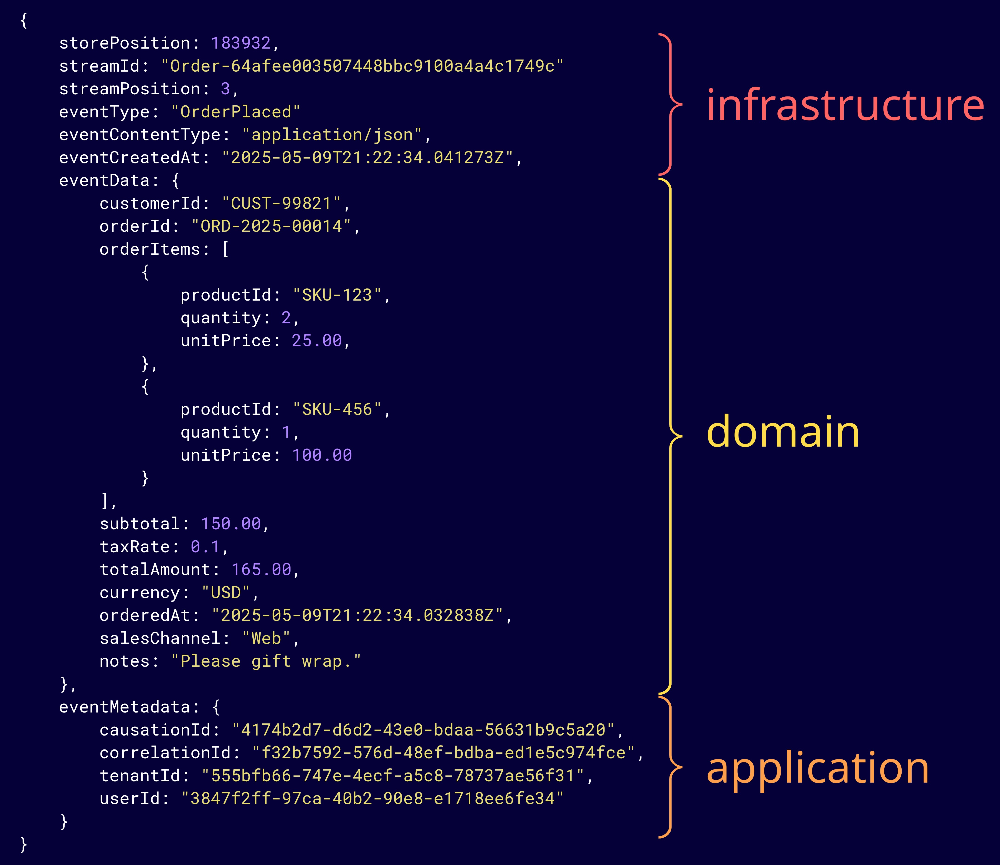

# Events

### The building blocks of time-aware, intention-revealing systems.

Events are more than technical artifacts, they represent real-world facts with a system. Understanding them is key to designing resilient, auditable, and scalable information architectures using Event Modeling and Event Sourcing. This article explores the nature of events in Event Modeling and Event Sourcing.

## What are Events?

An event is a fact that has occurred within a system and reflects a meaningful change in state as the outcome of an interaction. Events are given intentful names using past tense verbs. This naming convention helps to clearly distinguish events from commands, and emphasizes their nature as historical facts. For example:

- Order Placed
- Payment Processed
- Inventory Reserved
- Shipment Delivered

## Event Characteristics

**Immutable**

Once created, an event should never be modified. This can be enforced syntactically in many programming languages, otherwise it requires diligence by the software developers and system operators to enforce. This trait can also be enforced logically or physically using write-once read-many (WORM) storage devices.

**Atomic**

Each event should represent a single, complete fact. They should be clear and unambiguous on their own. A discrete piece of truth that make sense as a stand-alone real-world occurrence.

This trait improves composability. Systems can react flexibly and independently to each event.

**Descriptive**

Events should clearly indicate what happened. Their role is not just technical, events bridge the gap between a problem domain and software. Order Shipped clearly conveys what happened, where Update Order Status is vague. Descriptive names improve communication and understanding. 

Descriptive events aren't just nice to have, they are essential for building systems that are transparent and resilient over time. They tell the "what" in clear terms, letting the "how" be handled by the system.

**Contextual**

Events should include all relevant information about what occurred. Without context, even a well-named, descriptive event can be ambiguous or misleading. A good event not only describes what happened, but also who, what, when, where, and why. 

This enables decoupling so downstream consumers can make decisions.

For example: Payment Received

- Was it paid in or full or partial?
- What invoice does this relate to?
- What customer does this relate to?
- What payment method was used?

Systems shouldn't guess, this information should be embedded within the event.

## Event Representations

Events are not just technical constructs. They are collaborative modeling artifacts. In both **Event Modeling** and **Event Storming**, events are represented as **orange sticky notes** to visually anchor the discussion around business-relevent outcomes.

> 🟧 **Why orange?** 
>
> The color orange was popularized by [Alberto Brandolini](https://www.linkedin.com/in/brando/) in Event Storming to represent domain events. The bright color natually draws attention and helps distinguish events from other elements.

When modeling digitally using tools like [Miro](https://miro.com/), [Mural](https://www.mural.co/), or [Draw.io](https://draw.io), orange is easily available. However, when modeling in-person, orange sticky notes can be hard to find in bulk, possibly because Alberto has bought them all, causing a global shortage. In those cases, yellow is often used as a practical substitute. Just make sure everyone knows what it represents. I personally prefer to use gold, as it's a hybrid of yellow and orange, and emphasizes their importance...after all, if data is the new gold, then events are the gold nuggets that make it valuable.

Event Modeling goes a step further and defines the additional context to define a complete description for each event. This is important for providing information completeness. Sample values are included to enhance understanding.

### Beyond the name

**Event Modeling** adds structure to events beyond their names. Each event is fully described with contextual attributes, and sample data values to make the event concrete and more understandable. Events are linked to preceding inputs (commands) and results outputs (models). This representation bridges the gap between technical design and human understanding. It invites collaboration, highlights business meaning, and prevents assumptions.

When it comes to Event Sourcing, events are often enriched by different parts of the system, including the domain, application code, and infrastructure systems. Although the exact format depends on the language, libraries, and frameworks being used, events are ultimately simple data structures.

At the core is the domain event, which represents a meaningful fact in the business context, such as OrderPlaced. Application code typically adds metadata related to cross-cutting concerns. This can include values like **correlation id** and **causation id** for distributed tracing, a unique **event id** to ensure idempotency, and a **user id** for auditing purposes, a **tenant id** may be used for data isolation.

Infrastructure systems then add metadata needed for storage and event sequencing. This includes fields like stream id or stream name to indicate where the event belongs. Sequence numbers, stream versions, revisions, or positions are used to preserve order both globally and within a stream.

Each enrichment provides additional context while keeping the core fact of what happened intact.

Here is one possible representation of an event enriched with application and persistence information.

## Summary

Events are more than just data structures. They represent meaningful, immutable facts about what has happened within a system. By capturing the "what" with clarity and context, events become powerful tools for designing time-aware and intention-revealing systems. When used for collaborative modeling and as the foundation of an information architecture, well-structured events help teams communicate clearly, build resilient software, and trace how a system has changed over time.

Thoughtful event design is a foundational step toward building systems that accurately reflect the real world while supporting change and managing risk with confidence.
